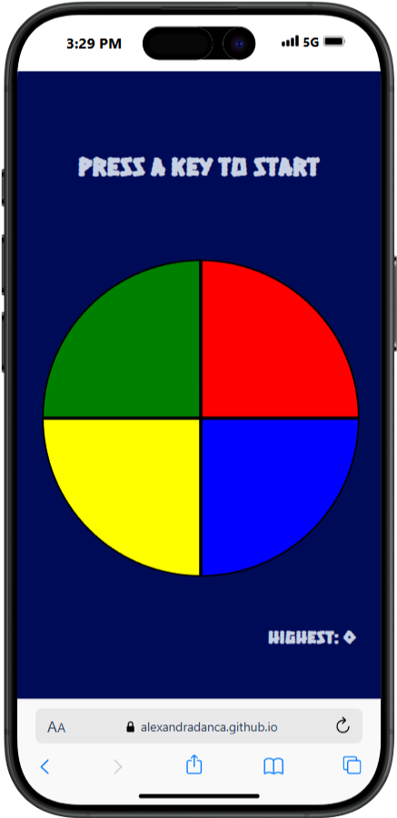
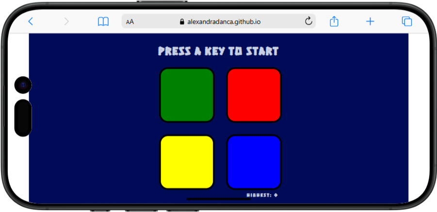

<h2 align="center">
 :game_die: <a href="https://alexandradanca.github.io/Simon-Game/" target="_blank">Simon Game</a>
</h2>

:joystick: A fun and interactive memory game that challenges players to repeat color sequences and test their skills. It was created during front-end learning journey

## Built With
- HTML
- CSS
- JavaScript
- jQuery

## Features

**🎨 Styled just with CSS**

**📱 Fully Responsive**

<h2>Mockup</h2>

 
  
  
  
  

<h2>Mockup mp4</h2>

  

https://github.com/user-attachments/assets/b61b263a-171f-4705-8033-d15aff66ecd8

